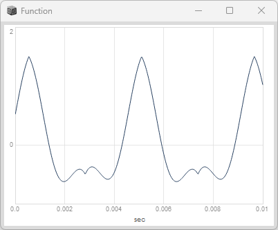
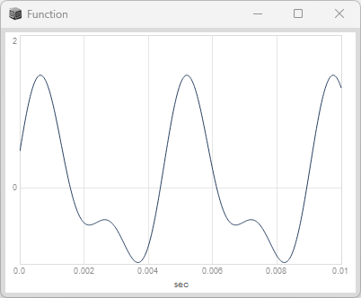
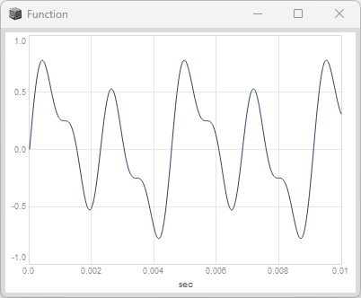
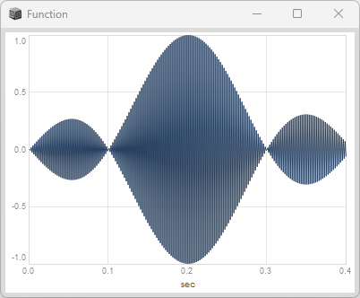

# 加算合成 (Additive synthesis)

## 加算 ( + )

```superCollider
{
   var a = SinOsc.ar(freq:440, phase:0, mul:0.5, add:0.0);
   var b = LFTri.ar(freq:220, iphase: 0.5, mul: 1.0, add: 0.0);
   a + b;
}.play;
```

#### Plot


#### 再生
<div><video controls src="https://amami-harhid.github.io/superColliderMovies/addotove/Mix_01.mp4" muted="false"></video></div>


## 配列でMixする
```superCollider
{
   var a = SinOsc.ar(freq:440, phase:0.0, mul:0.5, add:0.0);
   var b = SinOsc.ar(freq:220, phase:0.5, mul:1.0, add:0.0);
   Mix([a,b]);
}.play;
```
#### Plot


#### 再生
<div><video controls src="https://amami-harhid.github.io/superColliderMovies/addotove/Mix_02.mp4" muted="false"></video></div>

## ３音を加算

440Hz, 220Hz, 880Hz を合成しています。
スペクトルアナライズをみると 周波数の山が３つできていることがわかります。
加算合成は 基本周波数の倍音を加えていくことが多いです。
加算合成をするときは、加算結果の合計mul が 1を超えないようにすると耳に優しいです。

```superCollider
{
   var a = SinOsc.ar(freq:440, phase:0.0, mul:0.5, add:0.0);
   var b = SinOsc.ar(freq:220, phase:0.0, mul:0.25, add:0.0);
   var c = SinOsc.ar(freq:880, phase:0.0, mul:0.25, add:0.0);
   Mix([a,b,c]);
}.play;
```

#### Plot


#### 再生
<div><video controls src="https://amami-harhid.github.io/superColliderMovies/addotove/Mix3Sounds_01.mp4" muted="false"></video></div>

## 倍音以外を加算
```superCollider
{
   var a = SinOsc.ar(freq:440, phase:0.0, mul:0.5, add:0.0);
   var b = SinOsc.ar(freq:445, phase:0.0, mul:0.5, add:0.0);
   a + b;
}.play;
```

#### Plot
0.4秒間でプロットしたものです。ビョビョと周波数が変わる様子が見えると思います。
```superCollider
{
   var a = SinOsc.ar(freq:440, phase:0.0, mul:0.5, add:0.0);
   var b = SinOsc.ar(freq:445, phase:0.0, mul:0.5, add:0.0);
   a + b;
}.plot(0.4);
```


#### 再生
<div><video controls src="https://amami-harhid.github.io/superColliderMovies/addotove/Mix_NotHarmonic_01.mp4" muted="false"></video></div>

### ランダムに生成した音を重ねる（ rrand ）

ランダムに生成した音を重ねるときは  Mix.fill(n, function)を使う。

- n : 配列の数
- function : {  }で囲んだ音の集まり

```superCollider
{
   var n = 12;
   Mix.fill(n, {
      SinOsc.ar(
         freq:[rrand(40,2000), rrand(40,2000)],
         phase:0,
         mul:n.reciprocal * 0.75,
         add:0
      )
   });
}.play;
```


#### Plot


#### 再生
<div><video controls src="https://amami-harhid.github.io/superColliderMovies/additive/CodeSample_01.mp4" muted="false"></video></div>

## 補足解説

- rrand(a, b) : a と b の間のランダムな値 
- SimpleNumber.reciprocal : 逆数です。 12.reciprocal ==> 1/12


# pulseCount

```superCollider
{ 
   var impulse1 = Impulse.ar(10);
   var impulse2 = Impulse.ar(9);
   var pulseCount = PulseCount.ar(trig: impulse1, reset: impulse2 );
   SinOsc.ar( pulseCount*900, 0, 0.5);
}.scope;
```
