# ENV

## Env.linen

台形の形状を生成します。

```superCollider
var env = Env.linen(attackTime:0.05, sustainTime:0.2, releaseTime:0.5, level:0.7, curve:\lin);
env.test.plot;
```
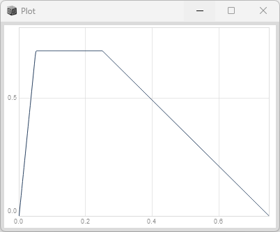

### curve種類 

### Env.linen(curve: \step)

最終値へすぐに移動する
```superCollider
var env = Env.linen(attackTime:0.05, sustainTime:0.2, releaseTime:0.5, level:0.7, curve: \step);
env.test.plot;
```
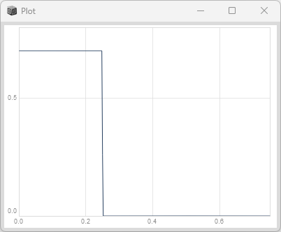

### Env.linen(curve: \hold)

最初の値を維持して最終値へ移動する

```superCollider
var env = Env.linen(attackTime:0.05, sustainTime:0.2, releaseTime:0.5, level:0.7, curve: \hold);
env.test.plot;
```
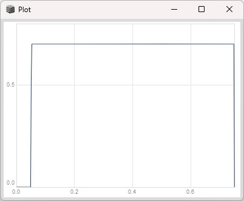

### Env.linen(curve: \sine)

サインカーブ的に減衰する

```superCollider
var env = Env.linen(attackTime:0.05, sustainTime:0.2, releaseTime:0.5, level:0.7, curve: \sine);
env.test.plot;
```
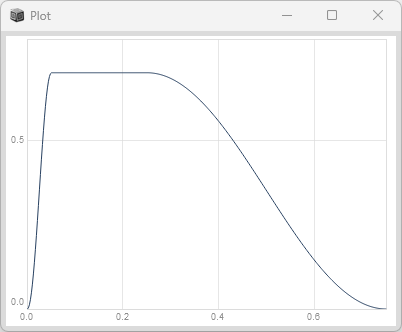

### Env.linen(curve: \welch)

サインカーブであるが最後がウェルチ窓風に減衰する

```superCollider
var env = Env.linen(attackTime:0.05, sustainTime:0.2, releaseTime:0.5, level:0.7, curve: \welch);
env.test.plot;
```
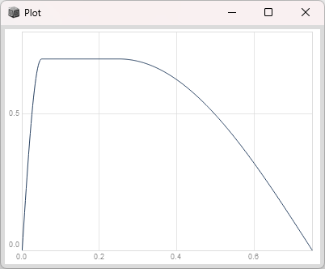

### Env.linen(curve: \squared)

二乗関数風に減衰する

```superCollider
var env = Env.linen(attackTime:0.05, sustainTime:0.2, releaseTime:0.5, level:0.7, curve: \squared);
env.test.plot;
```
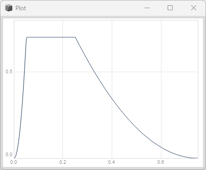

### Env.linen(curve: \cubed)

三乗関数風に減衰する

```superCollider
var env = Env.linen(attackTime:0.05, sustainTime:0.2, releaseTime:0.5, level:0.7, curve: \cubed);
env.test.plot;
```
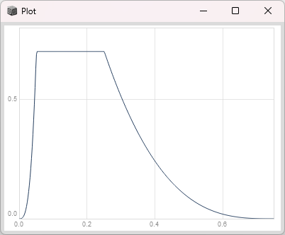


## Env.triangle
三角形の形状を生成します。

```superCollider
var env = Env.triangle(dur:1, level:1);
env.test.plot;
```


## Env.sine
サインカーブ形状を生成します。

```superCollider
var env = Env.sine(dur:1, level:1);
env.test.plot;
```
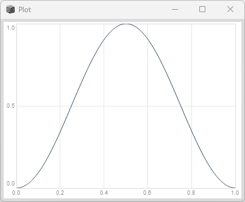

## Env.perc 
打楽器風のカーブ形状を生成します。

```superCollider
var env = Env.perc(attackTime: 0.01, releaseTime: 1.0, level: 1.0, curve: -4);
env.test.plot;
```
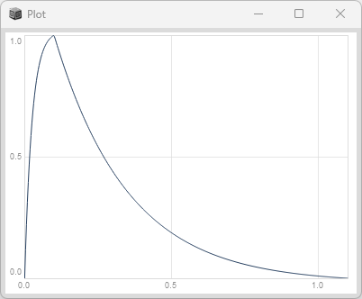

### sharper attack

```superCollider
var env = Env.perc(attackTime: 0.001, releaseTime: 1.0, level: 1.0, curve: -4);
env.test.plot;
```
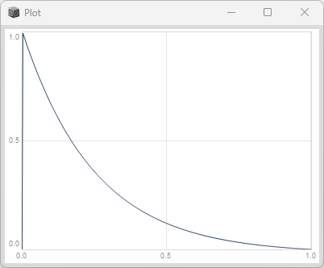

### change curvature

```superCollider
var env = Env.perc(attackTime: 0.001, releaseTime: 1.0, level: 1.0, curve: -8);
env.test.plot;
```
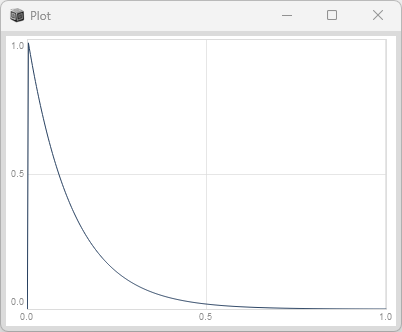

### reverse envelope

```superCollider
var env = Env.perc(attackTime: 0.001, releaseTime: 1.0, level: 1.0, curve: 4);
env.test.plot;
```
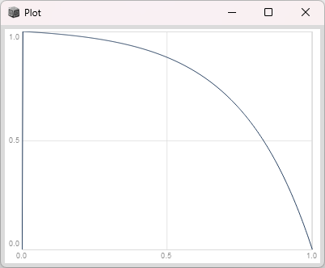

## Env.pairs

```superCollider
var pairs = [[0,1],[2.1,0.5],[3,1.4]]; 
var env = Env.pairs(pairs:pairs, curve:\lin);
env.test.plot;
```
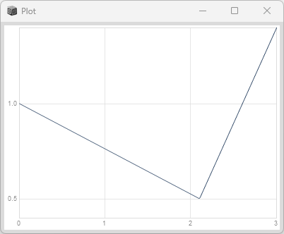

### Env.pairs(curve: \exp)

```superCollider
var pairs = [[0,1],[2.1,0.5],[3,1.4]]; 
var env = Env.pairs(pairs:pairs, curve:\exp);
env.test.plot;
```
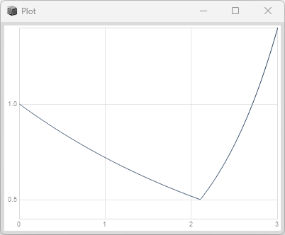


# コードサンプル

```superCollider
{
	var env = Env.linen(attackTime:0.05, sustainTime:0.2, releaseTime:0.5, level:0.7, curve:\lin);
    var f = 440;
	SinOsc.ar(freq:f) * EnvGen.kr(env, doneAction:2);
}.play;
```
## コードサンプル(2)
上のサンプルは一瞬で音が終わり録画がむずかしいため、50回繰り返すようにしたサンプルです。
```superCollider
var sound = {
	var env = Env.linen(attackTime:0.05, sustainTime:0.2, releaseTime:0.5, level:0.7, curve:'lin');
    var f = 440;
	SinOsc.ar(freq:f) * EnvGen.kr(env, doneAction:2);
};
{
   50.do {
		sound.play;
		1.wait; // 1秒間待つ。これを入れないと同時に50音が鳴る。
   }
}.fork();

```
<div><video controls src="https://amami-harhid.github.io/superColliderMovies/env/CodeSampleSinOscAndEnv.mp4" muted="false"></video></div>