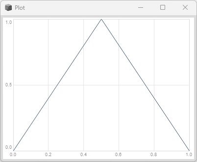
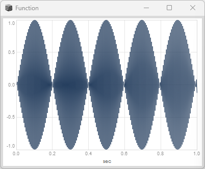
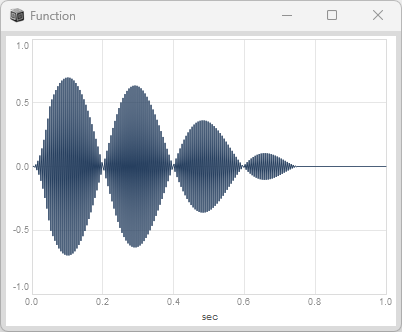
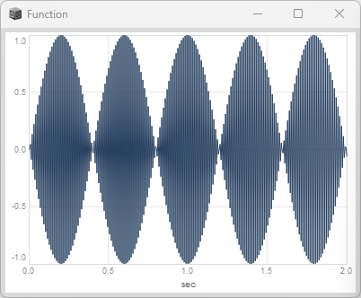
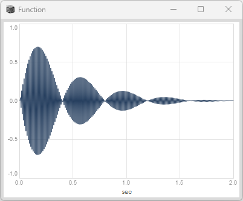

# ENV

## Env.linen

台形の形状を生成します。

```superCollider
var env = Env.linen(attackTime:0.05, sustainTime:0.2, releaseTime:0.5, level:0.7, curve:\lin);
env.test.plot;
```


### curve種類 

### Env.linen(curve: \step)

すぐに最後の値へ移動する（最初の値は無視される）
```superCollider
var env = Env.linen(attackTime:0.05, sustainTime:0.2, releaseTime:0.5, level:0.7, curve: \step);
env.test.plot;
```


### Env.linen(curve: \hold)

最初の値を維持し続ける。（減衰は無視される）

```superCollider
var env = Env.linen(attackTime:0.05, sustainTime:0.2, releaseTime:0.5, level:0.7, curve: \hold);
env.test.plot;
```


### Env.linen(curve: \sine)

サインカーブ的に減衰する

```superCollider
var env = Env.linen(attackTime:0.05, sustainTime:0.2, releaseTime:0.5, level:0.7, curve: \sine);
env.test.plot;
```


### Env.linen(curve: \welch)

サインカーブであるが最後がヴェルチ風に減衰する

```superCollider
var env = Env.linen(attackTime:0.05, sustainTime:0.2, releaseTime:0.5, level:0.7, curve: \welch);
env.test.plot;
```


### Env.linen(curve: \squared)

二乗関数風に減衰する

```superCollider
var env = Env.linen(attackTime:0.05, sustainTime:0.2, releaseTime:0.5, level:0.7, curve: \squared);
env.test.plot;
```


### Env.linen(curve: \cubed)

三乗関数風に減衰する

```superCollider
var env = Env.linen(attackTime:0.05, sustainTime:0.2, releaseTime:0.5, level:0.7, curve: \cubed);
env.test.plot;
```


## Env.triangle
三角形の形状を生成します。

```superCollider
var env = Env.triangle(dur:1, level:1);
env.test.plot;
```


## Env.sine
サインカーブ形状を生成します。

```superCollider
var env = Env.sine(dur:1, level:1);
env.test.plot;
```


## Env.perc 
打楽器風のカーブ形状を生成します。

```superCollider
var env = Env.perc(attackTime: 0.1, releaseTime: 1.0, level: 1.0, curve: -4);
env.test.plot;
```


### Env.perc (sharper attack)

アタックを強く

```superCollider
var env = Env.perc(attackTime: 0.001, releaseTime: 1.0, level: 1.0, curve: -4);
env.test.plot;
```


### change curvature

減衰を急激に

```superCollider
var env = Env.perc(attackTime: 0.001, releaseTime: 1.0, level: 1.0, curve: -8);
env.test.plot;
```


### reverse envelope

減衰のカーブの向きを変える

```superCollider
var env = Env.perc(attackTime: 0.001, releaseTime: 1.0, level: 1.0, curve: 4);
env.test.plot;
```


## Env.pairs

位置の配列を与えて位置を結ぶように形状を作ります。

```superCollider
var pairs = [[0,1],[2.1,0.5],[3,1.4]]; 
var env = Env.pairs(pairs:pairs, curve:\lin);
env.test.plot;
```


### Env.pairs(curve: \sine)

サインカーブを描きます。

```superCollider
var pairs = [[0,1],[2.1,0.5],[3,1.4]]; 
var env = Env.pairs(pairs:pairs, curve:\sine);
env.test.plot;
```


### Env.pairs(curve: \exp)

指数関数風にカーブします。

```superCollider
var pairs = [[0,1],[2.1,0.5],[3,1.4]]; 
var env = Env.pairs(pairs:pairs, curve:\exp);
env.test.plot;
```


# コードサンプル【１】

Env.linenを使って音の大きさを変化させているサンプルです。

attackTime(0.05) + sustainTime(0.2) + releaseTime(0.5) = 約 0.75 秒だけ音が聞こえます。

```superCollider
{
	var env = Env.linen(attackTime:0.05, sustainTime:0.2, releaseTime:0.5, level:0.7, curve:\lin);
	var f = 880;
	SinOsc.ar(freq:f) * EnvGen.kr(env, doneAction:2);
}.play;
```
### SinOsc.ar()のPlot


### SinOsc.ar()×EnvGen.kr() の Plot


###  録画（録音）のための操作
上のサンプルは一瞬で音が終わってしまい録画（録音）操作がむずかしいため、50回繰り返えしたサンプルです。

（50回繰り返す間に録画録音をしています）

```superCollider
var sound = {
	var env = Env.linen(attackTime:0.05, sustainTime:0.2, releaseTime:0.5, level:0.7, curve:'lin');
	var f = 880;
	SinOsc.ar(freq:f) * EnvGen.kr(env, doneAction:2);
};
{
   50.do {
	sound.play;
	1.wait; // 1秒間待つ。これを入れないと同時に50音が鳴る。
   }
}.fork();

```

### 録画再生

<div><video controls src="https://amami-harhid.github.io/superColliderMovies/env/CodeSampleSinOscAndEnv.mp4" muted="false"></video></div>


# コードサンプル【２】

Env.percを使って音の大きさを変化させているサンプルです。

attackTime(0.05) + releaseTime(2.0) = 約 2.05 秒だけ音が聞こえます。

```superCollider
{
	var env = Env.perc(attackTime: 0.01, releaseTime: 2.0);
	var f = 440;
	SinOsc.ar(freq:f) * EnvGen.kr(env, doneAction:2);
}.play;
```
### SinOsc.ar() のPlot


### SinOsc.ar()×EnvGen.kr()のPlot


### 録画再生

50回繰り返しをしている間に録画したものです。

<div><video controls src="https://amami-harhid.github.io/superColliderMovies/env/CodeSampleSinOscAndEnvPerc.mp4" muted="false"></video></div>
