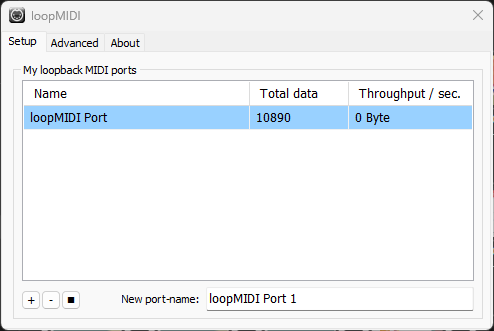
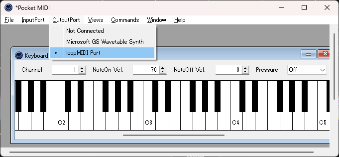

# sonicPiをMIDIで制御する

## loopMIDI

『loopMIDI』を使い 仮想 MIDI port を作っておきます(名前：loopMIDI Port)



## Pocket MIDI
『Pocket MIDI』のOutputPortを『loopMIDI Port』とします。


## SonicPI( MIDI Live ) 

キーボードを押したときの`note`(C3～F3)にそれぞれLiveLoopを対応づけます。
キーを押すと LiveLoopが動きだしたり 止まったりすることで、対応する音楽が鳴り始めたり消えたりします。

#### SonicPI Code
『SonicPI』側のコードは次のとおりです。
```ruby
use_debug false
MIDI_NOTE_ON = "/midi:loopmidi_port_0:1/note_on"
MIDI_PROGRAM_CHANGE = "/midi:loopmidi_port_0:1/program_change"
ON_LOOP01 = 60 # C3
ON_LOOP02 = 62 # D3
ON_LOOP03 = 64 # E3
ON_LOOP04 = 65 # F3
ACTIVE = 1
NOT_ACTIVE = 0
# グローバルタイムストアに ACTIVEnn を設定する(初期値:0)
4.times do |number|
  activeName = sprintf("ACTIVE%02d", number+1);
  set activeName, NOT_ACTIVE
end
# live_loopの制御用（実行と停止）
define :loopCtl do | loopNo |
  activeName = "ACTIVE#{loopNo}"
  cueName = "SYNC#{loopNo}"
  active = get[activeName]
  if get[activeName] == NOT_ACTIVE then
    # live_loop を Stopさせない設定
    set activeName, ACTIVE
    cue cueName # live_loopを開始する cue
  else
    # live_loop内で Stopする設定
    set activeName, NOT_ACTIVE
  end
end
live_loop :midi01 do
  # MIDI SYNC するまで待つ
  note, velocity = sync_bpm MIDI_NOTE_ON
  case note
  when ON_LOOP01 then
    loopCtl("01")
  when ON_LOOP02 then
    loopCtl("02")
  when ON_LOOP03 then
    loopCtl("03")
  when ON_LOOP04 then
    loopCtl("04")
  end
end
live_loop :midi02 do
  # MIDI GET する
  program,_ = get MIDI_PROGRAM_CHANGE
  bpm = 100 + 20 * program
  set :bpm, bpm
  sleep 0.5 # 適時待つ
end
# Metronome loop
live_loop :metro do
  use_bpm get[:bpm]
  sample :drum_cymbal_closed, amp: 1.0
  sleep 1
  sample :drum_cymbal_closed, amp: 0.5
  sleep 1
  sample :drum_cymbal_closed, amp: 0.5
  sleep 1
  sample :drum_cymbal_open, amp: 0.2
  sleep 1
end
# スレッドを起動
in_thread do
  # ループが始まる
  loop do
    sync :SYNC01 # 『cue "SYNC01"』 されたら開始する
    live_loop :LOOP01 ,sync: :metro do # metroループと同期する
      use_bpm get[:bpm]
      sample :drum_snare_soft, amp: 1.5
      sleep 4
      stop if get[:ACTIVE01] == NOT_ACTIVE # LOOP01を停止する
    end
  end
end
# スレッドを起動
in_thread do
  # ループが始まる
  loop do
    sync :SYNC02 # 『cue "SYNC02"』 されたら開始する
    live_loop :LOOP02 ,sync: :metro do # metroループと同期する
      use_bpm get[:bpm]
      sleep 1.0
      sample :drum_heavy_kick,amp: 0.5
      sleep 1.0
      sample :drum_heavy_kick,amp: 1.5
      sleep 1.0
      sample :drum_heavy_kick,amp: 0.5
      sleep 1.0
      stop if get[:ACTIVE02] == NOT_ACTIVE # LOOP02を停止する
    end
  end
end
# スレッドを起動
in_thread do
  # ループが始まる
  loop do
    sync :SYNC03 # 『cue "SYNC03"』 されたら開始する
    live_loop :LOOP03 ,sync: :metro do # metroループと同期する
      use_bpm get[:bpm]
      sample :bd_fat, amp: 2, sustain: 1.5
      sleep 1
      sample :drum_cymbal_pedal, amp: 0.5
      sleep 1
      sample :bd_fat, amp: 2, sustain: 1.5
      sleep 1
      sample :drum_cymbal_pedal, amp: 0.5
      sleep 1
      stop if get[:ACTIVE03] == NOT_ACTIVE # LOOP03を停止する
    end
  end
end
# スレッドを起動
in_thread do
  # ループが始まる
  loop do
    sync :SYNC04 # 『cue "SYNC04"』 されたら開始する
    live_loop :LOOP04 ,sync: :metro do # metroループと同期する
      use_bpm get[:bpm]
      sample :hat_noiz
      sleep 2.0
      sample :hat_noiz
      sleep 2.0
      stop if get[:ACTIVE04] == NOT_ACTIVE # LOOP04を停止する
    end
  end
end
```