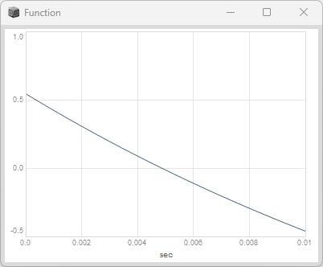
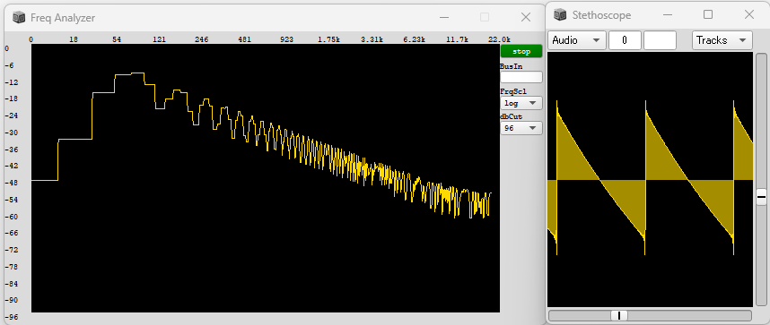
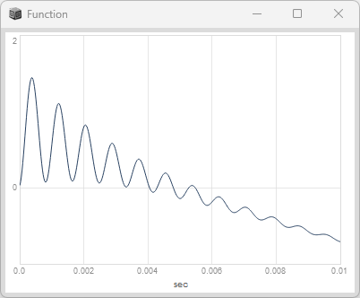
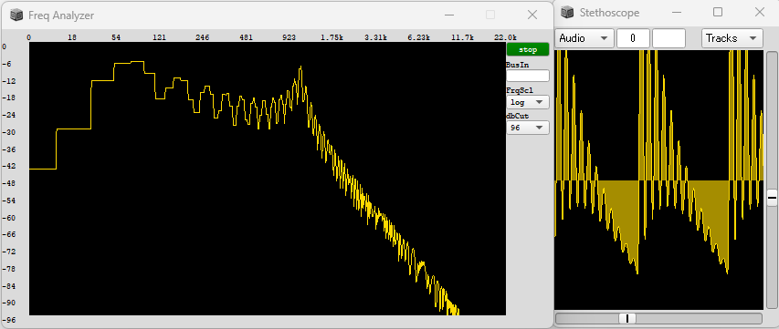
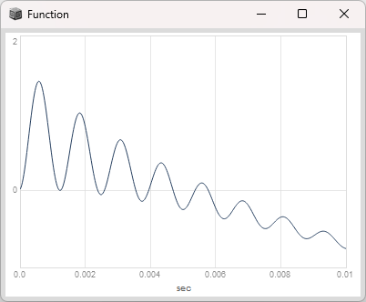
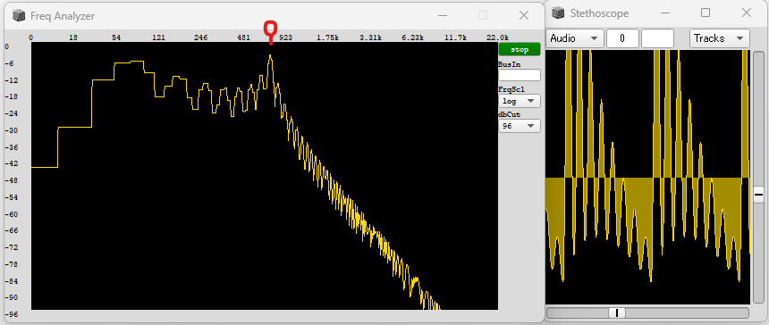
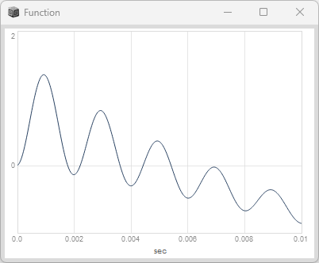
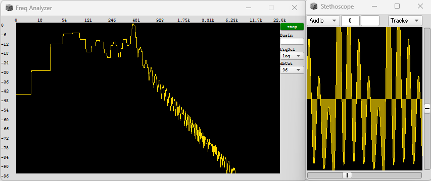

# フィルター ( Filter )

## 基本

## RLPF : ローパスフィルタ
```superCollider
RLPF.ar( in, freq, rq, mul, add );
```
### 原音(Saw)
```superCollider
{
    Saw.ar(freq:100, mul:1.0);
}.play
```



### RLPF( freq=1200)
```superCollider
{
    var saw = Saw.ar(freq:100, mul:1.0);
    RLPF.ar(saw, freq:1200, rq:0.1, mul:1.5 )
}.play
```



### RLPF( freq=800)
```superCollider
{
    var saw = Saw.ar(freq:100, mul:1.0);
    RLPF.ar(saw, freq:800, rq:0.1, mul:1.5 )
}.play
```



### RLPF( freq=500)
```superCollider
{
    var saw = Saw.ar(freq:100, mul:1.0);
    RLPF.ar(saw, freq:500, rq:0.1, mul:1.5 )
}.play
```



<div><video controls src="https://amami-harhid.github.io/superColliderMovies/subtractive/LPF_01.mp4" muted="false"></video></div>


## RHPF : ハイパスフィルタ
## BPF  : バンドバスフィルタ

## LPF

```superCollider
{
    var out;
    out = LPF.ar(
        Saw.ar([800, 840] ),
        LFNoise0.kr(4, 800, 840)
    );
    Out.ar(0, out);
}.play;

```
<div><video controls src="https://amami-harhid.github.io/superColliderMovies/subtractive/LPF_01.mp4" muted="false"></video></div>

### Saw
```superCollider
{
   Saw.ar([800, 840] );
}.play;
```
<div><video controls src="https://amami-harhid.github.io/superColliderMovies/subtractive/LPF_02.mp4" muted="false"></video></div>

### LFNoise
```superCollider
{
   LFNoise0.ar(4, 800, 840);
}.play;
```
<div><video controls src="https://amami-harhid.github.io/superColliderMovies/subtractive/LPF_03.mp4" muted="false"></video></div>
